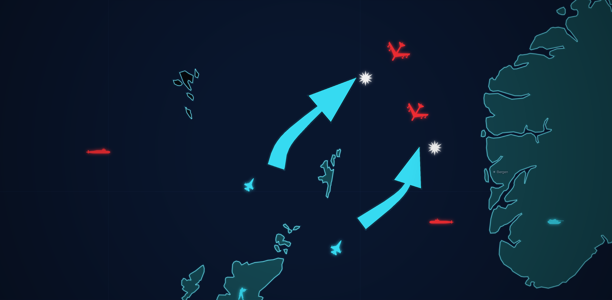
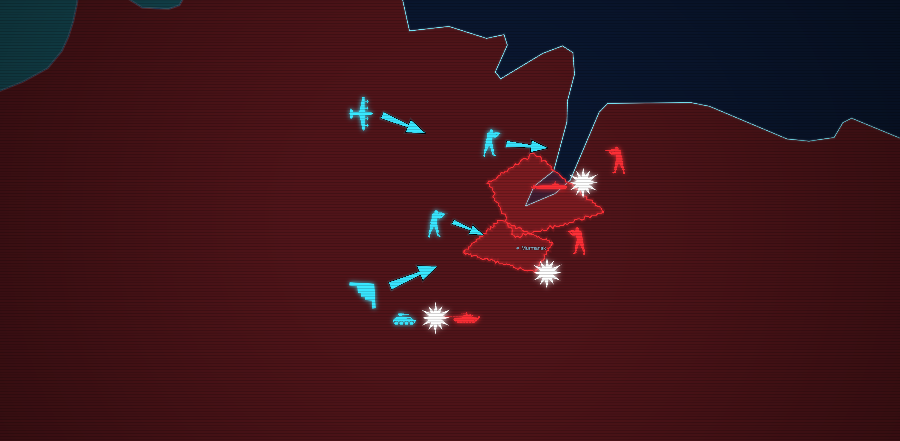
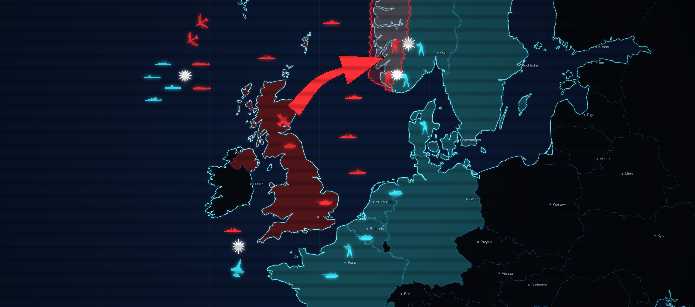

# Sitmap

[](https://tomaytotomato.github.io/sitmap/)

A map editor for drawing Cold War briefing maps in the style of World in Conflict and Red Storm Rising.



## Motivation

If you've played World in Conflict, you'll remember the mission briefing screens: a glowing tactical map, arrows sweeping across Europe, little red and
blue unit icons creeping towards each other, all lit up like a NORAD display in a Cold War thriller. 

It told you everything about the battle ahead without a single line of dialogue.

I really loved the aesthetic of this and wanted the ability to make my own maps like this.

So letting Claude loose with some screenshots and some interpretative guidance we have quite a fun little project.

## Features

Sitmap lets you illustrate a strategic map with BLUFOR (NATO) and OPFOR (Russia/China/PACT) units and other drawing tools.

You can then export those drawings as PNG images or save them for another time.





## Local Development

This uses plain old Javascript with Vue.js and Vite. 

```bash
npm install
npm run dev
```

Then open the printed local URL. 

`npm test` runs the geometry unit tests.

`npm run build` produces a static bundle in `dist/`.

### Adding new units

You can modify [units.js](src/lib/units.js)

Unit icons should ideally be SVG and dimensions of 700x700px, they are scaled down in the map to 50px
but increase in size as you zoom closer to the map.

## The tools

| Tool | What it does |
|---|---|
| **TERRITORY** | Click out a rough polygon. On finish the edge roughens into a jagged "radar contour" look and fills with the faction colour. A snap ring appears near the start point; click it to close. |
| **SHADE** | Click a country to flood it with the faction colour; click again with the same faction to unshade. |
| **ARROW** | Click a path. Renders as a tapered wedge (full width at the tail, narrowing to a sharp barbed head) so it reads as motion towards a position, not a bar with an arrowhead stuck on the end. |
| **UNIT** | Generic silhouettes (APC, rifleman, F-16, MiG-23, bomber, stealth bomber, transport, attack helicopter, generic ship/sub, battle burst), plus faction-locked real-world hulls: M1 Abrams, Arleigh Burke, Nimitz, Los Angeles-class and Type 23 Frigate for NATO only; T-80, Slava, Sovremenny, Grisha, Delta IV/Typhoon and Akula for PACT only. |
| **LABEL** | Click to drop a city-style dot with a name. |
| **ERASE** | Click anything (including a shaded country) to remove it. |

Click a placed unit (in any tool) to select it — it gets a dashed outline —
then: hold **R** and drag, or tap **[ / ]**, to rotate; scroll the mouse wheel
over it, or press **- / =**, to scale; **F** flips it horizontally; **Delete**
or **Backspace** removes it; **Esc** deselects.

Finish a territory or arrow with double-click, right-click or Enter; Esc
cancels. Factions: PACT (red), NATO (cyan), ALLIED (tan).

**ERA** switches the whole map between the modern day and a hand-traced 1980s
Cold War political boundary (the USSR, Czechoslovakia, Yugoslavia and a split
Germany all rebuilt from today's country data). **COUNTRY NAMES** and
**STRATEGIC BASES** are toggleable overlays; US state borders are always on.
Major cities fade in by zoom level: capitals first, then major cities, then
regional ones.

**EXPORT PNG** composites the map, all markers, scanlines and vignette into a
single image. **SAVE** / **LOAD** round-trip the scenario as JSON. There's
also a looping background track, because it felt wrong not to have one.

## Implementation and Styling

The coastline glow is three stacked line layers (wide blurred cyan, mid glow,
sharp core) over near-black land and deep navy sea, with dim borders.
Coastlines are LineStrings rather than filled polygons; stroking a polygon
shows MapLibre's internal tile-clipping seams. The CRT effect is a CSS overlay
(scanlines and a vignette) sitting above the canvas, not part of it.

Map data is 1:50m Natural Earth, tuned for theatre scale rather than street
level.

Unit icons live in `src/assets/military/` (SVGs — some from SVG Repo, some
hand-drawn, a few split from a single reference sheet) or
`src/lib/icon-paths.js` (extracted path data, via `scripts/extract-icons.mjs`).
Every icon tints to the faction colour the same way: drawn to an offscreen
canvas and recoloured with `source-in` compositing, which is why bitmap-based
SVGs tint fine with no `fill` to override. Adding a unit is one new file plus
one line in `SOURCES` (`src/lib/units.js`).

## Licence

MIT 

## Sources 

Map data: Natural Earth and US Census Bureau boundaries (via `world-atlas` and
`us-atlas`), public domain. 

Icons: SVG Repo (per-icon licences), game-icons.net
(CC BY 3.0, by Lorc, Delapouite & contributors) and Font Awesome Free
(CC BY 4.0). 

Music: "Main Menu" from the World in Conflict soundtrack, by Ola
Strandh 